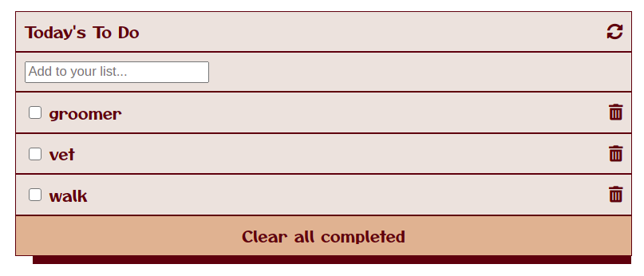

# To Do List

> This is a simple to-do list

Features:
- Draggable list items
- LocalStorage saving
- Checkbox functionality
## Built With

- Javascript
- webpack

## Live Demo

Coming soon

## Getting Started
### Prerequisites

  - Node.js
### Setup
  - Clone the following repository: https://github.com/RokoVarano/WP-TODO (branch feature/day3_DragNDrop)
### Install

  - In the clone folder, run npm run build
### Usage

  - Drag and drop list elements to sort them out.
  - Checkbox can be checked.
  - Status is saved to LocalStorage. Refresh the page to verify.
### Run tests
  
  - No tests yet 

## Authors

👤 **Rodrigo Ibaceta**

- GitHub: [Rodrigo Ibaceta](https://github.com/RokoVarano/)
- Twitter: [@Rodrigo](https://twitter.com/RodrigoIbacet11)
- LinkedIn: [LinkedIn](https://www.linkedin.com/in/rodrigo-ibaceta-a8657611a/)

## 🤝 Contributing

Contributions, issues, and feature requests are welcome!

Feel free to check the [issues page](../../issues/).

## Show your support

Give a ⭐️ if you like this project!

## Acknowledgments

- Hat tip to anyone whose code was used
- Inspiration
- etc

## 📝 License

This project is [MIT](./MIT.md) licensed.
{"mode":"full","isActive":false}